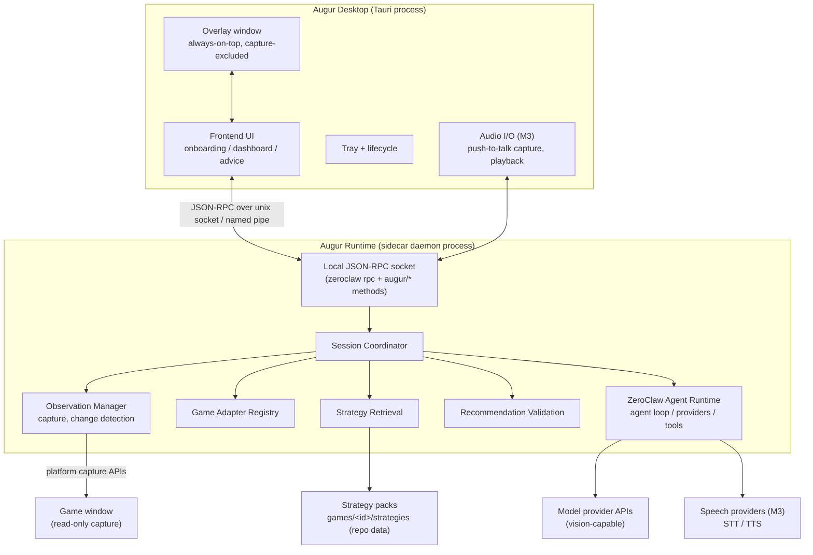
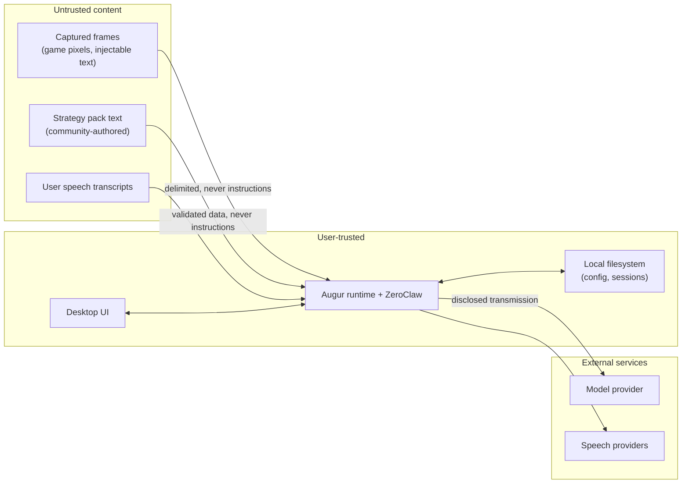

# Augur Architecture Overview

Augur is a real-time AI game-coaching desktop application built on the
ZeroClaw agent runtime. It observes a game window (with the user's
permission), extracts structured game state, retrieves season-specific
strategy from a version-controlled corpus, and presents advice in a desktop
GUI and optional overlay. It is a coach, not a bot: it never sends input to
the game, never reads game memory, and never automates gameplay.

Status of this document: **proposal**, part of the founding planning PR.
Statements about ZeroClaw cite the upstream source at commit `4d47d7955d`.

## Process boundaries

Augur runs as two OS processes plus external services:



Key boundary rules (enforced, not aspirational — see
[testing-and-evaluation.md](testing-and-evaluation.md)):

- `apps/augur-desktop` never links `zeroclaw-*` or `augur-runtime` crates; a
  CI dependency gate (copied from upstream
  `scripts/ci/zerocode_no_zeroclaw_dep_gate.sh`) enforces RPC-only access.
  This follows the upstream `apps/zerocode` precedent
  ([decision 0001](../decisions/0001-runtime-integration.md)).
- ZeroClaw crates never depend on Augur crates.
- Augur platform crates never depend on a specific game; game adapters depend
  only on `augur-game-api` and `augur-core`.
- Strategy packs are data; they cannot execute code.
- The desktop UI never calls model providers directly.

## Data flow: capture → recommendation

```mermaid
sequenceDiagram
    participant W as Game window
    participant CAP as augur-capture
    participant OBS as Observation Manager
    participant AD as Game Adapter
    participant SR as Strategy Retrieval
    participant ZC as ZeroClaw runtime
    participant P as Model provider
    participant UI as Desktop UI / Overlay

    W->>CAP: platform capture (window-scoped)
    CAP->>OBS: CapturedFrame (normalized, hashed)
    OBS->>OBS: change detection (skip if unchanged)
    OBS->>AD: parse_observation(frame, previous)
    AD->>OBS: GameStateEnvelope (confidence, evidence)
    OBS->>SR: strategy_scope(state)
    SR->>SR: filter + rank + cap (decision 0003)
    SR->>ZC: coaching context + [IMAGE:path] marker
    ZC->>P: multimodal request (vision route)
    P->>ZC: structured recommendation (streamed)
    ZC->>OBS: validate: schema, citations, observation_id
    OBS->>UI: publish only if observation still current
    UI->>UI: render advice + confidence + refs; expire on change
```

Every recommendation is bound to the `observation_id` it was generated from.
If the observed state changes before the model responds, the recommendation is
discarded or marked stale — never silently shown as current.

## ZeroClaw integration points

| Concern | ZeroClaw component (verified path) | How Augur uses it |
|---|---|---|
| Agent loop | `crates/zeroclaw-runtime/src/agent/turn/mod.rs` (`run_tool_call_loop`) | Unchanged; drives coaching turns |
| Desktop IPC | `crates/zeroclaw-runtime/src/rpc/` (JSON-RPC/NDJSON, socket + pipe) | Primary UI transport; extended with `augur/*` methods |
| Streaming | `SessionUpdateEvent` (`rpc/types.rs`) | UI renders chunks, tool calls, approvals |
| Vision | `crates/zeroclaw-providers/src/multimodal.rs`, `[IMAGE:]` markers | Screenshots enter as image markers on the coaching turn |
| Vision routing | `agent/turn/vision_route.rs`, `[multimodal] vision_model_provider` | Route image turns to a vision-capable model |
| Providers | `crates/zeroclaw-providers` (`ReliableModelProvider`) | Retry/fallback/cooldown reused unchanged |
| Tools | `Tool` trait + `ScopedToolRegistry` (`runtime/src/tools/scoped.rs`) | Strategy search + observation tools registered via `all_tools()` |
| Sessions | `crates/zeroclaw-infra/src/session_sqlite.rs` | Match transcript persistence |
| Config/secrets | `crates/zeroclaw-config` (ChaCha20-Poly1305, `enc2:`) | Provider keys; Augur adds namespaced config tables |
| Speech (M3) | `crates/zeroclaw-channels/src/{tts,transcription}.rs` (5 TTS / 6 STT providers) | Provider-replaceable voice, server-side |
| Eval | `crates/zeroclaw-eval` (deterministic trace replay) | Base for the recommendation evaluation harness |
| Logging | `crates/zeroclaw-log` (`record!`, redaction policies) | All Augur crates emit through it |
| Packaging | `scripts/desktop/prepare-kernel.sh`, release workflow | Sidecar staging pattern reused |

What ZeroClaw does **not** provide (built new in Augur): native window-scoped
capture (upstream `screenshot.rs` shells out to `screencapture`/`scrot`, no
Windows support, no window enumeration), overlay primitives, global hotkeys,
client-side audio, auto-update, and a markdown-corpus retrieval engine
(see [zeroclaw-reuse-audit.md](zeroclaw-reuse-audit.md)).

## Crate layout

Every crate below exists and compiles. What each one *does* arrives with its
own issue; what each one is *allowed to do* is fixed now, because dependency
directions are far cheaper to establish than to retrofit.

| Crate | Owns | May depend on |
|---|---|---|
| `augur-core` | Identifiers, observation envelope, recommendation contract, confidence and evidence vocabulary | Nothing Augur |
| `augur-game-api` | The `GameAdapter` trait, `GameManifest`, support status | `augur-core` |
| `augur-capture` | Window enumeration and window-scoped frame capture | `augur-core` |
| `augur-observation` | Match session state, observation lifecycle | `augur-core` |
| `augur-strategy` | Strategy-pack data and deterministic retrieval | `augur-core` |
| `augur-recommendation` | Citation checking, staleness, validation outcomes | `augur-core`, `augur-strategy` |
| `augur-policy` | Whether a game may be offered at all | `augur-core`, `augur-game-api` |
| `augur-voice` | Spoken coaching orchestration | `augur-core` |
| `augur-runtime` | Adapter registry, session coordination, `augur/*` RPC methods | All of the above, plus game adapters |
| `apps/augur-desktop` | The player-facing application | Nothing Augur. Talks over the local socket only |
| `games/<id>/adapter` | One game | `augur-core`, `augur-game-api` |

Two rows carry the weight. `augur-runtime` is the **only** crate permitted to
name a concrete game, because the registry is the single place a game is
mentioned; platform crates naming one fails the build. And
`apps/augur-desktop` depends on nothing in this table, which is what makes
decision 0001's boundary real rather than aspirational.

## Trust boundaries



Screenshots, strategy documents, and transcripts are **data, not
instructions**: system prompts are fixed and stored separately; strategy
content is delimited; regression fixtures assert that injected instructions in
either channel cannot alter tool access, capture scope, or credentials
(see [security-and-privacy.md](security-and-privacy.md)).

## Multi-game extension points

- `augur-game-api` defines `GameAdapter`, `GameManifest`, and the common
  envelopes; games register via a compile-time registry
  ([decision 0002](../decisions/0002-game-adapter-loading.md)).
- Each game owns `games/<game-id>/**`: adapter crate, `game.yaml` manifest,
  state schema, prompts, strategy packs, fixtures, tests, and
  `maintainers.yaml` (wired into CODEOWNERS).
- Support statuses: `experimental`, `community`, `maintained`, `deprecated`,
  `disabled-policy-review` — surfaced in the UI per game.
- An architecture-invariant test forbids game-specific identifiers in platform
  crates, in the style of upstream `tests/architecture/no_duplicate_state.rs`.

## Failure and cancellation paths

| Failure | Behavior |
|---|---|
| Provider slow/down | `ReliableModelProvider` retry/fallback; UI shows degraded state; last advice marked stale, never refreshed silently |
| Model lacks vision | `resolve_vision_provider` routes or fails closed with an actionable UI state |
| Capture permission denied | Explicit UI state with OS-settings deep link (macOS FFI exists upstream: `apps/tauri/src/macos/permissions.rs`) |
| Observed state changes mid-turn | In-flight recommendation invalidated by `observation_id` mismatch |
| Extraction confidence low | Advice falls back to fundamentals; uncertainty stated in the recommendation |
| Runtime crash | Desktop detects socket loss, offers restart; sidecar supervisor restarts daemon |
| User cancels / voice barge-in (M3) | `session/cancel` RPC aborts the turn |

The full state inventory is in [the product docs](../product/user-experience.md)
under "Degraded and offline states".

## Data-retention boundaries

Screenshots are ephemeral (in-memory or temp files deleted after the turn;
never persisted by default). Audio is never retained; transcripts only with
explicit opt-in. Session transcripts (text) persist locally under the
workspace sessions store. Anything leaving the machine (frames and context to
the model provider, audio to speech providers) is disclosed in onboarding and
in the active-capture indicator. Details and threat model:
[security-and-privacy.md](security-and-privacy.md).
